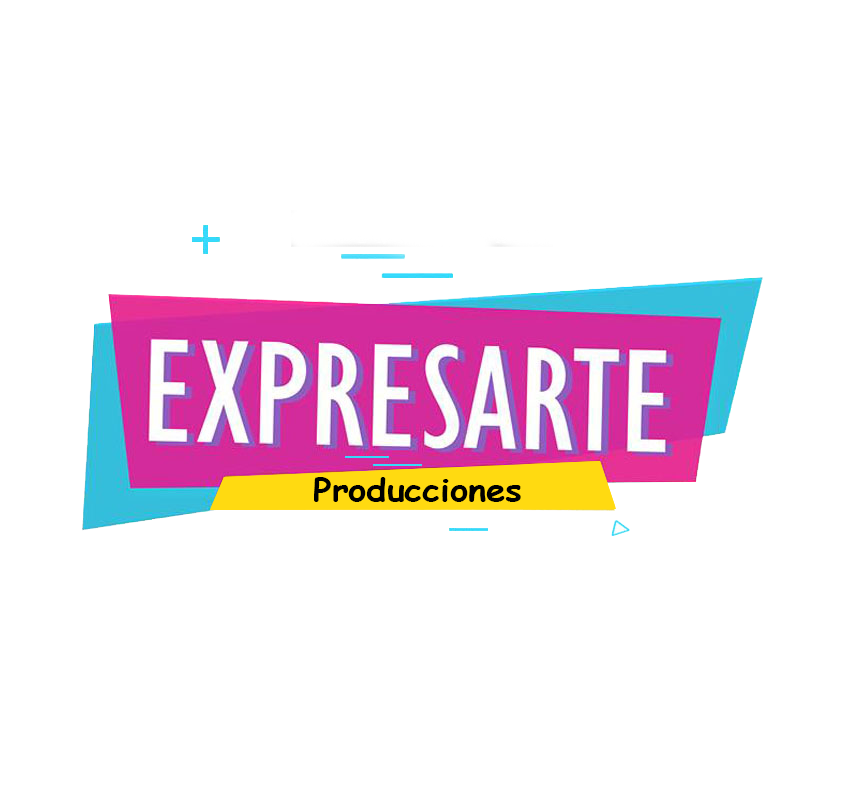

# 🎶 Expresarte · Sistema Académico para Escuelas de Música

**Expresarte** es una plataforma modular pensada para la gestión educativa de escuelas de música. Incluye control de períodos académicos, profesores, estudiantes, cátedras, inscripciones y evaluaciones, con énfasis en arquitectura limpia, escalabilidad y orientación API.



---

## 🧩 Características actuales

- ✅ Modelo robusto de base de datos con SQLAlchemy
- ✅ Sistema académico estructurado: períodos, cátedras y evaluaciones
- ✅ Controladores independientes para cada entidad
- ✅ Seed inteligente para pruebas con datos reales
- ✅ Enums auto-documentados (`Role`, `Catedra`)
- ✅ Soporte WTForms y plantilla base estilizada con Bulma
- ✅ Arquitectura lista para migración a API REST
- ✅ Documentación técnica clara y modular

---

## 🧭 Roadmap de desarrollo

### 1. 🧠 Backend
- [x] Modelos con `to_dict()` para uso en APIs
- [x] Controladores por entidad con validaciones
- [ ] Modelo relacional para `Canción` como arte final
- [ ] Controller para gestión de `Canción`
- [ ] Verificación y testing de controladores
- [ ] Dockerización de la aplicación
- [ ] Soporte opcional para PostgreSQL y MariaDB

### 2. 🧑‍🏫 Módulos académicos
- [ ] Rutas para gestión de estudiantes, profesores y cátedras
- [ ] Formularios WTForms completos por entidad
- [ ] Vista para profesores (gestión de grupos y evaluaciones)
- [ ] Vista para estudiantes (calificaciones, canción final)

### 3. 📱 Frontend responsivo
- [ ] Adaptación Mobile-First
- [ ] Componentes e assets para Progressive Web App (PWA)
- [ ] Plantillas limpias con navegación intuitiva

### 4. 🌐 API REST con FastAPI
- [ ] Implementación de endpoints con Pydantic
- [ ] JWT y gestión de autenticación
- [ ] Versionado de la API
- [ ] Pruebas automatizadas

### 5. 🌍 Frontend desacoplado
- [ ] Proyecto con Vite + React (tentativo Tailwind CSS)
- [ ] Consumo de API con integración dinámica
- [ ] Manejo de sesiones y roles en el cliente

---

## 🛠 Estructura del proyecto

```
app/
├── database/
│   ├── models/
│   ├── controllers/
│   ├── enums/
│   └── seeds/
├── server/
│   ├── routes/
│   └── server.py
├── templates/
├── static/
│   ├── assets/
│   └── styles/
├── config/
└── run.py
```

---

## 🚀 Cómo iniciar

```bash
# Instala dependencias
pip install -r requirements.txt

# Ejecuta localmente
python run.py
```

> ℹ️ En modo DEBUG, se activa un seed académico inteligente con datos de prueba.

---

## 📚 Créditos

Este proyecto está liderado por **Gabriel Baute**, con enfoque en extensibilidad, claridad arquitectónica y transición progresiva hacia microservicios y frontend desacoplado.

---